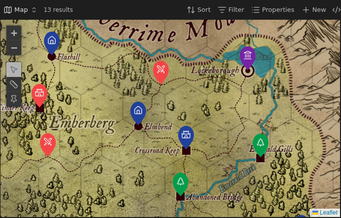
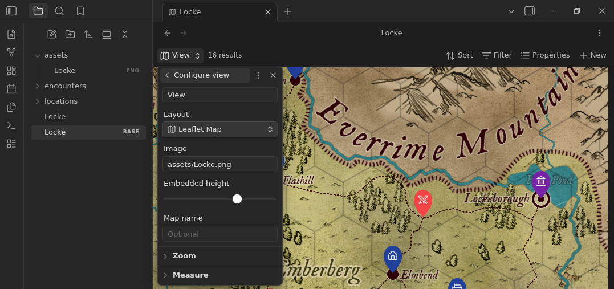
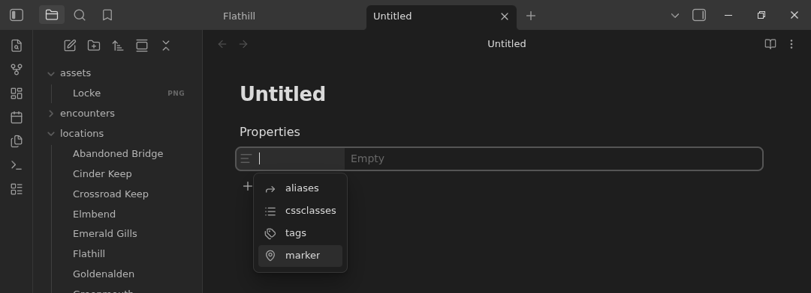
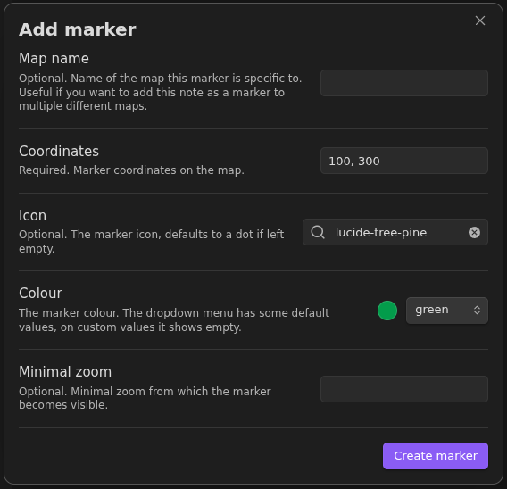
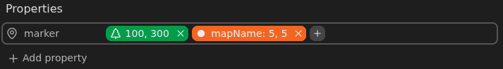
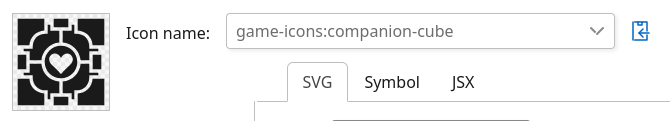
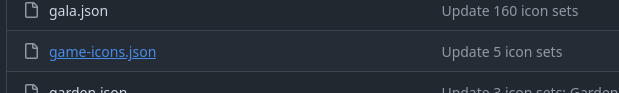
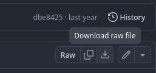

# Leaflet Bases



This plugin for [Obsidian](https://obsidian.md) adds a new bases view: 'Leaflet Map' and a new type of property: 'marker'

> Leaflet Bases is still in the testing phase. While you can be confident that no current features will be dramatically changed, you should expect the occasional bug.
> Please report any issues you encounter [here](https://github.com/Requiae/obsidian-leaflet-bases-plugin/issues).

Leaflet bases was developed for three reasons:

- To leverage the versatility of [Obsidian bases](https://help.obsidian.md/bases)
- Marker data is part of the note it belongs to, not of the map it is shown on
- To have your maps be available in your online garden using [Quartz](https://quartz.jzhao.xyz/), the is a [separate Quartz plugin](https://github.com/Requiae/quartz-leaflet-map-plugin) for that.

> For use with Quartz you'll need the [appropiate Quartz plugin](https://github.com/Requiae/quartz-leaflet-map-plugin). Quartz does not support bases yet, but the developers are working hard and a beta is expected sometime in the coming months.

## Installation

This plugin currently requires Obsidian v1.11.4 or later to work.

### Install via BRAT

1. Install the [BRAT plugin](https://obsidian.md/plugins?search=BRAT) under Community Plugins.
2. Open BRAT settings and click "Add beta plugin".
3. Enter the URL of this repository: `https://github.com/Requiae/obsidian-leaflet-bases-plugin`.
4. Under "Select a version", choose the Latest version.
5. Click "Add plugin".

### Install via Community Plugins

Leaflet Bases is not yet available under Community Plugins. It is currently still in the testing phase.

## Usage

> You can find an example vault [here](https://github.com/Requiae/obsidian-leaflet-bases-plugin-example).

### Adding a map

#### Using configurations

1. First you need a [base](https://help.obsidian.md/bases) and add a 'Leaflet Map' view.
   
2. Change the settings as you wish.

#### Using a code block

You can also embed the base:

````yaml
```base
views:
  - type: leaflet-map
    name: Map
    mapName: test
    image: assets/Locke.png
    height: 400
    minZoom: -1.5
    maxZoom: 2
    defaultZoom: -1.5
    zoomDelta: 0.25
    scale: "0.2"
    unit: km
```
````

| Setting       |             | What it does                                                                            |
| ------------- | ----------- | --------------------------------------------------------------------------------------- |
| Layout        | type        | The type of base, don't change this (from Obsidian bases)                               |
| -             | name        | What the view is called (from Obsidian bases)                                           |
| Image         | image       | The image the map should show. It also accepts wiki links.                              |
| Map name      | mapName     | Optional identifier for the map. Useful if you want to reuse a note across several maps |
| Default zoom  | defaultZoom | The zoom value the map opens with                                                       |
| Minimum zoom  | minZoom     | How far you can zoom out                                                                |
| maximum zoom  | maxZoom     | How far you can zoom in                                                                 |
| Zoom stepsize | zoomDelta   | How much you zoom                                                                       |
| Scale         | scale       | How much to scale the result of the measure tool                                        |
| Unit          | unit        | The unit the measure tool uses (think km, mi, hours)                                    |

> Technically only 'type', 'name', and 'image' are required for the map view to work. However you'll likely end up using most of the other settings.

> Instead of setting `mapName` in the base, you can also use a bases filter;
>
> ```yaml
> views:
>   - type: leaflet-map
>     name: Map
>     image: assets/Locke.png
>     filters:
>       and:
>         - '!marker.filter(value.mapName == "MAP_NAME").isEmpty()'
> ```

### Adding a marker

#### Using UI

1. Add a new marker property to the note you want to have a marker.
   
2. Add a marker using the '+' button that appeared. Fill in the form in the modal and click 'Create marker'.
   
3. You can add more markers using the '+' button, add markers by clicking the tags, or remove them using the 'x' buttons.
   

#### Using source code frontmatter

Ensure that the frontmatter block is the first thing in your note.

```yaml
---
marker:
  - coordinates: 100, 300
    icon: lucide-tree-pine
    colour: "#039c4b"
    minZoom: 1
  - coordinates: 5, 5
    mapName: mapName
    colour: "#bdf123"
---
```

> Keep in mind that markers are arrays, many code editors automatically add an `-` when you start a new line. Ensure you only have the dashes where a new marker entry starts.

| Setting      |             | What it does                                                                                |
| ------------ | ----------- | ------------------------------------------------------------------------------------------- |
| Map name     | mapName     | If you want this marker to only show for a certain map, set this to the mapname of that map |
| Coordinates  | coordinates | Where the marker is placed on the map                                                       |
| Icon         | icon        | Which icon to use for the marker. Can be any [lucide icon](https://lucide.dev/icons/).      |
| Colour       | colour      | Which colour the marker will be                                                             |
| Minimal zoom | minZoom     | How far zoomed in the map should be before the marker becomes visible                       |

> Technically only 'coordinates' is required for the marker to be valid. However you'll likely end up using most of the other settings.

> Coordinates can easily be obtained using the 'copy' (📌) tool in the map. Clicking a spot on the map automatically copies the coordinates to your clipboard.

### Adding icons to Obsidian

> Any icons added to Obsidian using another plugin should work just fine as long as their icons stick to Obsidian's design limitations. However, these icons likely won't work with Quartz.

1. Go to the [Iconify website](https://icon-sets.iconify.design/) and find the iconset you want.
2. Select any icon and find the set prefix. In the image this is `game-icons`
   
3. Now go to the [Iconify Github](https://github.com/iconify/icon-sets/tree/master/json) and find the json file that corresponds to your chosen set. Open it.
   
4. Download the raw file
   
5. Open Obsidian. The open your vault settings. Under community plugins, go to `Leaflet bases`
6. Under `Additional icon sets`, find the option to add iconsets and click the button. It will open a prompt where you can select the file you just downloaded. Press `open` and the iconset has been added!

## Alternatives

### Leaflet ([link](https://github.com/javalent/obsidian-leaflet))

The OG for Obsidian fantasy maps has to be mentioned. It is no longer under active development and has been in maintenance mode for years.

### Zoom map ([link](https://github.com/Jareika/zoom-map))

This plugin is awesome, comprehensive, and feature rich. If you do not wish to use Obsidian bases, your markers to be saved in your notes, nor to host your garden using Quartz then I highly recommend you to take a look at this plugin!

### Map view ([link](https://help.obsidian.md/bases/views/map))

My inspiration and my frustration, for it does not allow images to be used for your maps, and the workarounds are difficult, not accessible, and tend to break GitHub ToS.
